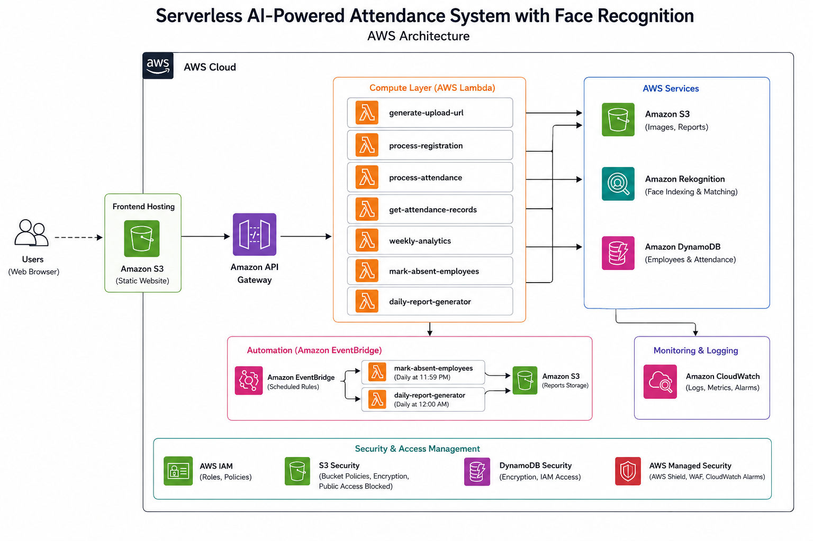

---
# Serverless Attendance System with Face Recognition

## Overview

This project is a fully serverless AI-powered attendance system built on AWS.

The system allows employees to mark attendance using facial recognition through a web interface.

AWS Rekognition identifies employees, Lambda processes attendance logic, and DynamoDB stores attendance records.

---

## Features

* Face Recognition Attendance
* Clock-In / Clock-Out Tracking
* Employee Registration
* Admin Dashboard
* Attendance Analytics
* Automated Absentee Marking
* Daily Attendance Reports
* EventBridge Scheduling
* S3 Lifecycle Policies
* Secure IAM Permissions

---

## AWS Services Used

* AWS Lambda
* Amazon Rekognition
* Amazon DynamoDB
* Amazon S3
* Amazon API Gateway
* Amazon EventBridge
* Amazon CloudWatch
* IAM

---

## Architecture



---

## Project Workflow

1. Employee uploads image
2. Image stored in S3
3. Lambda triggered automatically
4. Rekognition identifies employee
5. Attendance stored in DynamoDB
6. Dashboard displays attendance records
7. EventBridge automates reports

---

## Deployment Instructions

### 1. Clone Repository

---
git clone https://github.com/jeffinsojan14/serverless-face-attendance-system.git
---

---

### 2. Create Required S3 Buckets

Create these buckets:

* attendance-images-{yourname}
* employee-registration-images-{yourname}
* attendance-reports-{yourname}
* attendance-frontend-{yourname}

Enable:

* Block Public Access (except frontend bucket)
* Versioning
* Bucket Encryption

Enable Static Website Hosting for:

* attendance-frontend bucket

---

### 3. Create DynamoDB Tables

Create:

#### Employees Table

* Partition Key: employee_id

#### Attendance Table

* Partition Key: employee_id
* Sort Key: date

---

### 4. Create Rekognition Collection

Create face collection:

```text
employee-face-collection
```

---

### 5. Deploy Lambda Functions

Deploy all Lambda functions:

* generate-upload-url
* process-registration
* process-attendance
* get-attendance-records
* weekly-analytics
* mark-absent-employees
* daily-report-generator

Runtime:

* Python 3.12

IAM Role:

* attendance-lambda-role

---

### 6. Configure API Gateway

Create routes:

* POST /generate-upload-url
* GET /attendance-records

Enable CORS.

Deploy API.

---

### 7. Configure EventBridge

Create scheduled rules:

#### Absent Marking

```text
cron(59 18 * * ? *)
```

#### Daily Report Generation

```text
cron(0 19 * * ? *)
```

Connect rules to corresponding Lambda functions.

---

### 8. Upload Frontend

Upload frontend files into:

```text
attendance-frontend bucket
```

Files:

* index.html
* style.css
* script.js
* register.html
* register.css
* register.js
* dashboard.html
* dashboard.css
* dashboard.js

---

### 9. Configure Environment Variables

Add Lambda environment variables:

| Key              | Value                    |
| ---------------- | ------------------------ |
| COLLECTION_ID    | employee-face-collection |
| ATTENDANCE_TABLE | Attendance               |

---

### 10. Test Application

Workflow:

1. Register employee
2. Upload attendance image
3. Rekognition identifies employee
4. Attendance stored in DynamoDB
5. Dashboard displays analytics
6. EventBridge automates reports

---

## Security Features

* Least Privilege IAM
* DynamoDB Encryption
* S3 Lifecycle Rules
* API Throttling
* CloudWatch Monitoring

---

## Future Improvements

* Mobile app
* Cognito authentication
* Email notifications
* Real-time analytics
* Multi-face detection

---

## Deployment Status

Frontend deployment is currently hosted using Amazon S3 Static Website Hosting.

CloudFront HTTPS deployment is planned as a future enhancement for secure browser camera access.

----

